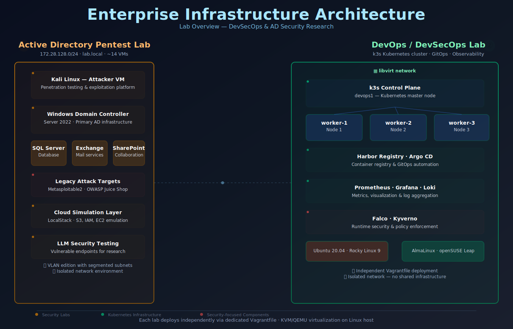

# Sysadmin Security Lab

[](LICENSE)


[](https://github.com/solo2121/sysadmin-security-lab/actions/workflows/ci.yml)

A modular hands-on lab for Linux System Administration, Cybersecurity, DevOps, and DevSecOps practice.

This repository provides two independent enterprise lab environments and supporting tooling for infrastructure simulation, security research, automation, detection engineering, and professional portfolio development.

**Maintained by:** Miguel A. Carlo (solo2121)  
**Project Status:** Active Development

---

## Table of Contents

- [Architecture Overview](#architecture-overview)
- [Overview](#overview)
- [Highlights](#highlights)
- [Who This Project Is For](#who-this-project-is-for)
- [Portfolio Goals](#portfolio-goals)
- [Choose Your Lab](#choose-your-lab)
- [Lab 1 – Active Directory Pentest Lab](#lab-1-active-directory-pentest-lab)
- [Lab 2 – DevOps / DevSecOps Lab](#lab-2-devops-devsecops-lab)
- [Repository Structure](#repository-structure)
- [Requirements](#requirements)
- [Quick Start](#quick-start)
- [Skills Demonstrated](#skills-demonstrated)
- [Documentation Hub](#documentation-hub)
- [Security and Ethics](#security-and-ethics)
- [Contributing](#contributing)
- [License](#license)

---

## Architecture Overview



### Two Independent Lab Environments

- **Lab 1 – Active Directory Pentest Lab** (172.28.128.0/24)  
  Windows enterprise security environment with domain controllers, member servers, cloud simulation, and AI security testing.

- **Lab 2 – DevOps / DevSecOps Lab**  
  Linux-centric Kubernetes platform with k3s control plane, worker nodes, container registry, observability stack, and runtime security.

Each lab deploys independently via dedicated Vagrantfile on KVM/QEMU virtualization infrastructure. See [Architecture Documentation](docs/architecture/architecture.md) for detailed infrastructure design and networking specifications.

---

## Overview

Sysadmin Security Lab is a modular enterprise homelab built for learning and practicing Linux administration, Active Directory security, cloud-native infrastructure, DevOps, and DevSecOps.

The project is organized into independent virtual lab environments that can be deployed separately, allowing focused practice without affecting other environments.

It combines enterprise infrastructure, offensive security, defensive engineering, cloud-native technologies, automation, Infrastructure as Code, and modern DevSecOps workflows into a single professional-grade learning platform.

---

## Highlights

- Two fully independent enterprise lab environments.
- Automated provisioning using Vagrant, Libvirt, and KVM.
- Enterprise Active Directory and AD CS security research.
- Kubernetes platform engineering with GitOps workflows.
- Infrastructure as Code using Terraform, OpenTofu, and Ansible.
- DevSecOps tooling including Falco and Kyverno.
- Continuous Integration for automated project validation.
- AI and LLM security testing and experimentation.
- Comprehensive documentation covering architecture, deployment, troubleshooting, and workflows.

---

## Who This Project Is For

This repository is intended for:

- Linux System Administrators.
- Security Engineers.
- Penetration Testers.
- DevOps Engineers.
- DevSecOps Engineers.
- Platform Engineers.
- Students building enterprise homelabs.
- Professionals learning modern infrastructure and security engineering.

---

## Portfolio Goals

This repository demonstrates practical experience with:

- Linux system administration.
- Enterprise Active Directory.
- Infrastructure automation.
- DevOps and GitOps workflows.
- DevSecOps engineering.
- Detection engineering.
- Kubernetes administration.
- Infrastructure as Code.
- Security research in isolated lab environments.

---

## Choose Your Lab

Choose the environment that matches your learning objectives.

### Lab 1 – Active Directory Pentest Lab

Focus areas:

- Windows enterprise infrastructure.
- Active Directory.
- AD Certificate Services (AD CS).
- Detection engineering.
- Cloud attack simulation.
- AI and LLM security testing.

### Lab 2 – DevOps / DevSecOps Lab

Focus areas:

- Kubernetes.
- GitOps.
- Infrastructure as Code.
- Observability.
- Runtime security.
- Policy enforcement.
- Platform engineering.

Each lab is independent and can be deployed separately.

---

## Lab 1 – Active Directory Pentest Lab

**Directory:** `labs/security/ad-pentest/`

**Alternative VLAN deployment:** `labs/security/ad-pentest-vlan/`

This Windows enterprise security lab is designed for Active Directory security research, adversary emulation, post-exploitation analysis, detection engineering, cloud attack simulation, and AI/LLM security testing.

| Component | Description |
|---|---|
| Domain Controller | Windows Server 2022 (`lab.local`) |
| Certificate Authority | AD CS (ESC1, ESC3, ESC4, ESC7, ESC9) |
| Member Servers | Exchange, SQL Server, SharePoint, Print Server |
| Workstations | Windows 10 domain joined |
| Attacker VM | Kali Linux |
| Cloud Simulation | LocalStack (AWS services) |
| AI Security | Prompt injection, prompt leakage, jailbreaks, token abuse, RAG security |
| Legacy Targets | Metasploitable2, OWASP Juice Shop |

The VLAN edition expands the environment into segmented enterprise networks for advanced attack path and lateral movement simulations.

---

## Lab 2 – DevOps / DevSecOps Lab

**Directory:** `labs/infrastructure/devops-linux-lab/`

This is a Linux-centric cloud-native platform engineering environment focused on Kubernetes operations, infrastructure automation, GitOps, observability, and security engineering.

| Component | Description |
|---|---|
| Kubernetes | k3s cluster |
| Additional Clusters | Kind, K3d |
| GitOps | Argo CD |
| Registry | Harbor |
| Monitoring | Prometheus |
| Dashboards | Grafana |
| Logging | Loki + Promtail |
| Runtime Security | Falco |
| Policy Engine | Kyverno |
| Certificate Management | Cert-Manager |
| Infrastructure as Code | Terraform, OpenTofu |
| Configuration Management | Ansible |
| Linux Nodes | Ubuntu, Rocky Linux, AlmaLinux, openSUSE |

This environment provides practical experience in cloud-native operations, automation, DevSecOps, and platform engineering.

---

## Repository Structure

```text
sysadmin-security-lab/
├── .github/
│   └── workflows/
├── assets/
├── docs/
│   ├── architecture/
│   ├── guides/
│   ├── workflows/
│   └── archive/reference/
├── labs/
│   ├── infrastructure/
│   │   └── devops-linux-lab/
│   └── security/
│       ├── ad-pentest/
│       └── ad-pentest-vlan/
├── scripts/
├── security/
├── sysadmin/
├── tests/
├── CHANGELOG.md
├── CONTRIBUTING.md
├── CODE_OF_CONDUCT.md
├── installation.md
├── LICENSE
├── SECURITY.md
├── troubleshooting.md
└── README.md
```

---

## Requirements

Before deploying either lab:

### Host Requirements

- Linux host recommended.
- Hardware virtualization enabled.
- KVM/QEMU.
- Libvirt.
- Vagrant.
- Virt-Manager.
- Sufficient CPU, RAM, and storage.
- Internet connectivity.

---

## Quick Start

### Clone the repository

```bash
git clone https://github.com/solo2121/sysadmin-security-lab.git
cd sysadmin-security-lab
```

### Install dependencies

Install the required dependencies by following the [Installation Guide](installation.md).

### Deploy Active Directory Lab

```bash
cd labs/security/ad-pentest
vagrant up dc01
vagrant up
```

### Deploy DevOps / DevSecOps Lab

```bash
cd labs/infrastructure/devops-linux-lab
vagrant up
```

---

## Skills Demonstrated

| Area | Technologies |
|---|---|
| Linux Administration | Ubuntu, Rocky Linux, AlmaLinux, openSUSE |
| Virtualization | KVM, Libvirt, Vagrant |
| Infrastructure as Code | Terraform, OpenTofu, Ansible |
| DevOps | Git, CI/CD, Release Workflows |
| Kubernetes | k3s, Kind, K3d |
| GitOps | Argo CD |
| Monitoring | Prometheus, Grafana, Loki |
| DevSecOps | Falco, Kyverno |
| Containers | Docker, Harbor |
| Cloud | AWS Concepts, LocalStack |
| Active Directory | Windows Server, Kerberos, LDAP |
| AD CS | ESC1–ESC9 |
| Detection Engineering | MITRE ATT&CK, Log Analysis |
| Security Testing | Nmap, BloodHound, Metasploit, Hashcat |
| AI Security | Prompt Injection, Prompt Leakage, Jailbreak Testing, RAG Security |

---

## Documentation Hub

| Document | Purpose |
|---|---|
| [PORTFOLIO.md](docs/portfolio.md) | Portfolio index and skills mapping |
| [architecture.md](docs/architecture/architecture.md) | Infrastructure design |
| [security-scope.md](docs/architecture/security-scope.md) | Security boundaries |
| [installation.md](installation.md) | Full installation guide |
| [setup-with-examples.md](docs/setup-with-examples.md) | Deployment walkthrough |
| [TROUBLESHOOTING.md](troubleshooting.md) | Common issues |
| [CHANGELOG.md](CHANGELOG.md) | Project history |

---

## Security and Ethics

This project is intended solely for education, authorized security research, and defensive security practice.

Only perform testing against systems you own or where you have explicit authorization.

Unauthorized access, testing, or exploitation of external systems is strictly prohibited.

---

## Contributing

Contributions are welcome.

- Open an issue before major changes.
- Keep pull requests focused.
- Update documentation when needed.
- Follow project contribution guidelines.

See `CONTRIBUTING.md` for details.

---

## License

This project is licensed under the MIT License.

See [LICENSE](LICENSE) for details.

<<<<<<< HEAD
Copyright (c) 2025–2026 Miguel A. Carlo
=======
Copyright (c) 2025–2026 Miguel A. Carlo
>>>>>>> chore/repository-standardization
