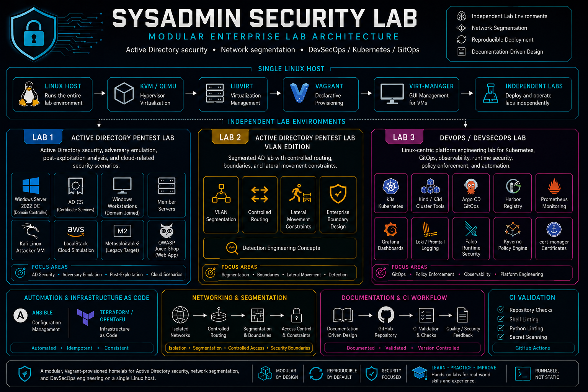

# Sysadmin Security Lab

[](LICENSE)  
  
  
  
  
[](https://github.com/solo2121/sysadmin-security-lab/actions/workflows/ci.yml)

**Sysadmin Security Lab is a production-style, fully deployable homelab for practicing real-world Active Directory attacks, DevSecOps workflows, Kubernetes operations, and infrastructure automation.**

Built with Vagrant and KVM/libvirt, every environment in this repository is designed to run locally and simulate enterprise scenarios—not just document them.

Designed for security engineers, sysadmins, and DevSecOps practitioners who want hands-on, reproducible lab environments.

**Maintainer:** Miguel A. Carlo (solo2121)  
**Status:** Active development

---

## What you can do with this lab

- Simulate full Active Directory attack paths (Kerberoasting, AS-REP roasting, AD CS abuse, NTLM relay, DCSync)
- Practice lateral movement across VLAN-segmented enterprise networks
- Deploy and operate a Kubernetes-based DevSecOps platform (k3s, Argo CD, Falco, Kyverno)
- Build infrastructure using Terraform/OpenTofu and Ansible
- Explore AI/LLM security risks (prompt injection, data leakage, RAG vulnerabilities)
- Analyze logs and detection strategies aligned with MITRE ATT&CK

---

## Architecture overview



### Independent lab environments

- **Active Directory Pentest Lab** (`labs/security/ad-pentest/`)  
  Enterprise Windows environment for AD attacks, post-exploitation, and adversary simulation.

- **AD Pentest Lab (VLAN edition)** (`labs/security/ad-pentest-vlan/`)  
  Segmented network with routing boundaries for realistic lateral movement scenarios.

- **DevOps / DevSecOps Lab** (`labs/infrastructure/devops-linux-lab/`)  
  Kubernetes-based platform engineering environment with observability, security, and automation.

Each lab deploys independently using Vagrant on KVM/QEMU.

---

## Highlights

- Realistic Active Directory attack paths with documented walkthroughs
- VLAN-segmented lab for network-aware attack and defense scenarios
- Kubernetes-based DevSecOps platform with security tooling
- Infrastructure as Code with reproducible deployments
- CI-integrated repository with linting and validation
- AI and cloud security testing in controlled environments

---

## Quick start

### 1. Clone

```bash
git clone https://github.com/solo2121/sysadmin-security-lab.git
cd sysadmin-security-lab
```

### 2. Install dependencies

See: `docs/setup/installation.md`  
(Optional) Run:

```bash
scripts/check-prerequisites.sh
```

### 3. Deploy a lab

**Active Directory lab**
```bash
cd labs/security/ad-pentest
vagrant up dc01
vagrant up
```

**VLAN lab**
```bash
cd labs/security/ad-pentest-vlan
vagrant up dc01
vagrant up
```

**DevSecOps lab**
```bash
cd labs/infrastructure/devops-linux-lab
vagrant up
```

---

## Skills demonstrated

- Linux administration (Ubuntu, Rocky, AlmaLinux, openSUSE)
- Virtualization (KVM, libvirt, Vagrant)
- Infrastructure as Code (Terraform, OpenTofu, Ansible)
- Kubernetes (k3s, Kind, K3d)
- GitOps (Argo CD)
- Observability (Prometheus, Grafana, Loki)
- DevSecOps (Falco, Kyverno)
- Active Directory security (Kerberos, LDAP, AD CS)
- Detection engineering (MITRE ATT&CK, log analysis)
- Offensive security tooling (BloodHound, Metasploit, Hashcat)
- AI/LLM security (prompt injection, RAG risks)

---

## Documentation

- Start here: `docs/learning-path.md`
- Architecture: `docs/architecture/architecture.md`
- Setup: `docs/setup/installation.md`
- Walkthrough: `docs/guides/security/domain-compromise-walkthrough.md`
- Troubleshooting: `docs/setup/troubleshooting.md`

---

## Requirements

- Linux host
- KVM/QEMU + libvirt
- Vagrant
- Hardware virtualization enabled
- Recommended: 64 GB RAM for full AD lab (smaller profiles available)

---

## Security and ethics

This project is intended for education and authorized security research only.

Do not test systems without explicit permission.

---

## Contributing

Contributions are welcome.  
See `CONTRIBUTING.md` for guidelines.

---

## License

MIT License — see `LICENSE`

Copyright © 2023–2026 Miguel A. Carlo