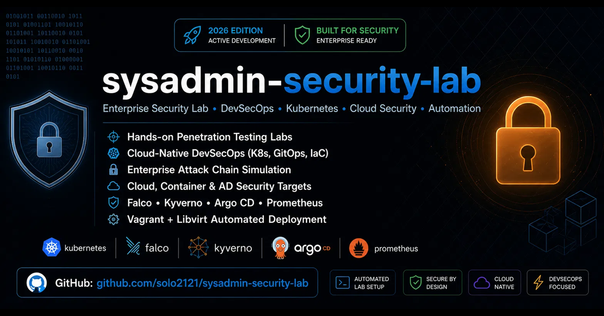

# Sysadmin Security Lab

<p align="center">
  
</p>

<p align="center">
  
  
  
  
  
  
</p>

**Status:** Active portfolio project
**Maintainer:** solo2121
**Primary focus:** Linux administration, infrastructure automation, security engineering, and reproducible lab design

---

## Overview

Sysadmin Security Lab is a portfolio-grade monorepo for building, operating, and testing realistic local infrastructure and security environments. It combines Linux administration scripts, Vagrant/KVM lab environments, Active Directory attack-defense scenarios, network segmentation practice, and detection/security research tooling.

This repository is designed to show practical engineering ability, not just isolated notes or scripts. It demonstrates how to organize repeatable labs, document safe usage boundaries, automate common operations, and connect sysadmin, DevOps, and security workflows into one coherent platform.

---

## What This Demonstrates

| Area | Evidence in this repo |
|------|------------------------|
| Linux systems administration | Hardening, monitoring, maintenance, firewall, backup, and utility scripts under [`sysadmin/`](sysadmin/) |
| Infrastructure engineering | Vagrant + KVM/libvirt labs under [`labs/infrastructure/`](labs/infrastructure/) |
| DevOps foundations | Kubernetes, Ansible, Terraform, Helm, GitOps, and observability documentation |
| Security engineering | Reconnaissance, network testing, detection engineering, and security validation tools under [`security/`](security/) |
| Active Directory security | AD attack-chain lab, VLAN segmentation lab, lab credentials, and defense documentation |
| Documentation quality | Architecture, installation, workflow, troubleshooting, and safety scope docs under [`docs/`](docs/) |

---

## Featured Labs

| Lab | Path | What it proves |
|-----|------|----------------|
| DevOps Linux Lab | [`labs/infrastructure/devops-linux-lab/`](labs/infrastructure/devops-linux-lab/) | Local infrastructure provisioning, Linux administration, Kubernetes practice, monitoring, and automation |
| Active Directory Pentest Lab | [`labs/security/ad-pentest/`](labs/security/ad-pentest/) | Controlled AD enumeration, Kerberos attacks, privilege escalation paths, and remediation thinking |
| VLAN Enterprise Lab | [`labs/security/ad-pentest-vlan/`](labs/security/ad-pentest-vlan/) | Network segmentation, subnet design, VLAN testing, and enterprise-style lab architecture |

Each lab includes its own README, Vagrantfile, scripts, and supporting documentation.

---

## Repository Map

```text
sysadmin-security-lab/
├── assets/                         # Banner and visual assets
├── docs/                           # Architecture, workflows, security scope, setup examples
├── labs/                           # Reproducible infrastructure and security labs
│   ├── infrastructure/
│   │   └── devops-linux-lab/
│   └── security/
│       ├── ad-pentest/
│       └── ad-pentest-vlan/
├── security/                       # Standalone security tools and experiments
│   ├── detection-engineering/
│   ├── network-security-analysis/
│   ├── security-testing-lab/
│   ├── threat-reconnaissance/
│   └── wireless-security-lab/
├── sysadmin/                       # Linux automation, monitoring, hardening, utilities
│   ├── automation/
│   ├── git/
│   ├── monitoring/
│   ├── system-hardening/
│   └── utilities/
├── INSTALLATION.md
├── TROUBLESHOOTING.md
├── SECURITY.md
└── README.md
```

---

## Quick Start

Install the host dependencies first:

```bash
sudo apt update
sudo apt install -y qemu-system-x86 libvirt-daemon-system libvirt-clients \
  bridge-utils virt-manager vagrant
sudo usermod -aG libvirt,kvm "$USER"
```

Install the required Vagrant plugins:

```bash
vagrant plugin install vagrant-libvirt
vagrant plugin install vagrant-reload
```

Clone the repository:

```bash
git clone https://github.com/solo2121/sysadmin-security-lab.git
cd sysadmin-security-lab
```

Run a specific lab from its directory:

```bash
cd labs/infrastructure/devops-linux-lab
vagrant validate
vagrant up
```

For full setup instructions, see [`INSTALLATION.md`](INSTALLATION.md).

---

## Safe Use

This repository contains offensive security content for controlled labs only. Before running any security lab:

1. Read [`docs/SECURITY-SCOPE.md`](docs/SECURITY-SCOPE.md).
2. Use only isolated VMs and networks you own or are authorized to test.
3. Do not run offensive tooling against public, production, employer, or third-party systems without explicit written permission.
4. Treat all included credentials as intentionally weak lab-only credentials.

---

## Documentation

| Document | Purpose |
|----------|---------|
| [`INSTALLATION.md`](INSTALLATION.md) | Host setup, dependencies, Vagrant/libvirt installation |
| [`docs/ARCHITECTURE.md`](docs/ARCHITECTURE.md) | Repository architecture and design boundaries |
| [`docs/SECURITY-SCOPE.md`](docs/SECURITY-SCOPE.md) | Authorized-use policy and lab isolation requirements |
| [`docs/WORKFLOWS.md`](docs/WORKFLOWS.md) | Operational and development workflows |
| [`docs/SETUP-WITH-EXAMPLES.md`](docs/SETUP-WITH-EXAMPLES.md) | Example setup paths and commands |
| [`TROUBLESHOOTING.md`](TROUBLESHOOTING.md) | Common problems and fixes |
| [`CONTRIBUTING.md`](CONTRIBUTING.md) | Contribution expectations |

---

## Suggested Reviewer Path

If you are reviewing this as a portfolio project, start here:

1. Read this README for scope and project structure.
2. Review [`docs/ARCHITECTURE.md`](docs/ARCHITECTURE.md) for design intent.
3. Inspect [`labs/infrastructure/devops-linux-lab/Vagrantfile`](labs/infrastructure/devops-linux-lab/Vagrantfile) for infrastructure automation.
4. Inspect [`labs/security/ad-pentest/docs/ATTACK_CHAIN.md`](labs/security/ad-pentest/docs/ATTACK_CHAIN.md) for AD lab methodology.
5. Review [`sysadmin/system-hardening/`](sysadmin/system-hardening/) and [`security/detection-engineering/`](security/detection-engineering/) for practical scripting examples.

---

## Roadmap

- Add a unified lab launcher for common `vagrant` operations.
- Add CI checks for shell syntax, Python syntax, Markdown links, and Vagrant validation.
- Add more diagrams and screenshots for each featured lab.
- Standardize per-lab metadata files for prerequisites, resources, and expected outputs.

---

## License

This project is licensed under the MIT License. See [`LICENSE`](LICENSE) for details.
