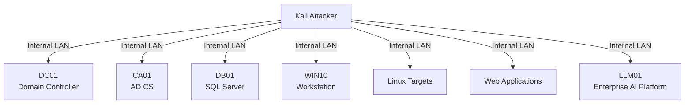
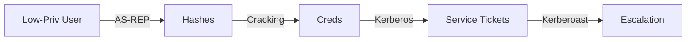
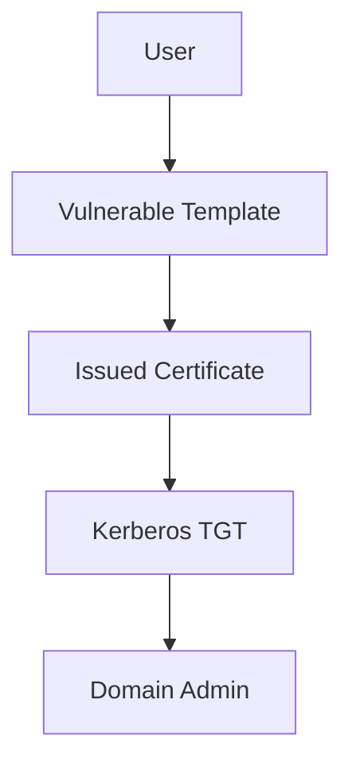

# Active Directory Pentest Lab (libvirt/KVM)

**Enterprise-style Active Directory and AI attack‑chain documentation** for a deliberately vulnerable lab environment using **Vagrant with libvirt/KVM**.

> **Warning**
> This lab is intentionally insecure and designed **only** for controlled training, research, and documentation.
> Do **not** expose this environment to the internet or production networks.

---

## 1. Document Scope and Operator Intent

This document describes the **architecture, networking model, and intended attack paths** of the Active Directory Pentest Lab.

It is designed to:

- Document **enterprise-style attack chains**
- Prevent **libvirt/KVM networking misconfiguration**
- Serve as **authoritative lab documentation** (not deployment automation)
- Support **PJPT / CRTP / CRTO / AI Security–style training and self-study**

This document assumes the operator already understands:

- Active Directory fundamentals
- Linux and Windows networking
- Basic cloud and container concepts

---

## 2. Environment Architecture Overview

The lab simulates a **modern hybrid enterprise environment**, combining:

- On‑premises Active Directory
- Active Directory Certificate Services (AD CS)
- Legacy and modern Windows systems
- Linux infrastructure
- Cloud and container-adjacent attack surfaces
- Vulnerable web applications
- **Enterprise AI / LLM services with intentional security flaws**

All attack paths are **intentional, scoped, and repeatable**.

---

## 3. Network Architecture (Critical – libvirt/KVM)

This environment is **explicitly designed for libvirt/KVM**.
Networking behavior **differs from VirtualBox and VMware**.

### 3.1 Network Segments

#### Management Network (NAT)

- Provided by libvirt `default` network
- Used for:
  - Internet access
  - Package updates
  - Tool installation

- **Not used for attack traffic**

#### Corporate Internal Network (Isolated LAN)

- Subnet: `172.28.128.0/24`
- Fully isolated Layer 2 network
- No routing to external networks
- All attack traffic remains internal

---

### 3.2 Network Topology Diagram

---

## 4. libvirt Design Rules (Mandatory)

- **Two NICs per virtual machine**
  - NIC 1: NAT (management)
  - NIC 2: Corporate internal LAN

- Static IP addressing is **required**

- Corporate LAN must be a **named libvirt network** with `forward_mode: none`

- No DHCP assumptions

- No host-only or bridged networking

> Misconfigured networking will break DNS, Kerberos, SMB relay, certificate-based attacks, and AI service authentication flows.

---

## 5. Systems and Roles

| Hostname        | IP                | Role                             |
| --------------- | ----------------- | -------------------------------- |
| kali-libvirt    | 172.28.128.10     | Attacker                         |
| DC01            | 172.28.128.21     | Domain Controller                |
| DB01            | 172.28.128.23     | SQL / Kerberoast target          |
| CA01            | 172.28.128.24     | AD Certificate Services          |
| WIN10           | 172.28.128.30     | Domain workstation               |
| vuln-ubuntu     | 172.28.128.11     | Cloud / DevOps target            |
| metasploitable2 | 172.28.128.12     | Legacy Linux                     |
| metasploitable3 | 172.28.128.13     | Web server                       |
| msf-win2k8      | 172.28.128.14     | Legacy Windows                   |
| juice-shop      | 172.28.128.15     | OWASP web application            |
| **LLM01**       | **172.28.128.20** | **Enterprise AI / LLM Platform** |

### LLM01 – Enterprise AI Platform

LLM01 simulates a **corporate-deployed AI service** integrated into the internal network.

It is intentionally vulnerable to demonstrate:

- OWASP Top 10 for LLM Applications
- AI-specific attack paths inside enterprise environments
- Lateral movement and data leakage via AI services

---

## 6. Attack Chain Overview

### 6.1 Initial Access

- LLMNR / NetBIOS poisoning
- AS-REP roasting
- Credential capture via misconfigurations
- Web application exploitation
- **AI API abuse and weak authentication**

---

### 6.2 Credential Access

- AS-REP roasting
- Kerberoasting (SQL SPNs)
- Cleartext and reusable credentials
- **Secrets leaked via AI context and logs**

---

### 6.3 Lateral Movement

- SMB relay
- Credential reuse
- Service account abuse
- WinRM / SMB / WMI movement
- **Pivoting through LLM01-hosted services**

---

### 6.4 Privilege Escalation

- ACL abuse
- Delegation abuse
- AdminSDHolder misconfiguration
- Local privilege escalation on endpoints
- Container breakout via misconfigured AI services

---

### 6.5 AD Certificate Services Abuse

- ESC1, ESC6, ESC8, ESC9 attack paths

---

### 6.6 Cloud, Container, and AI Attack Paths

- Hardcoded cloud credentials
- Terraform state file exposure
- Docker socket abuse
- Kubernetes misconfigurations
- **Prompt injection (direct and indirect)**
- **AI API abuse and authorization bypass**
- **Sensitive data disclosure via LLM context**
- **AI supply-chain and plugin abuse**

LLM01 acts as a **realistic enterprise pivot point** back into AD and cloud resources.

---

## 7. Post-Boot Validation Checklist

### Windows Systems

- DNS configured **only** to `DC01 (172.28.128.21)`
- Domain traffic bound to internal LAN NIC
- NAT NIC has **no DNS configured**

### Kali Linux

- Internet access via NAT
- All attack traffic routed via `172.28.128.0/24`

---

## 8. Rules of Engagement

- Never expose the lab to real networks
- Never reuse credentials outside the lab
- Do not mix lab traffic with production systems
- Authorized training and research use only

---

## 9. References and Tooling

- SpecterOps Active Directory Attack Path documentation
- Microsoft Active Directory and AD CS documentation
- OWASP Top 10 for LLM Applications
- BloodHound
- Impacket
- Certipy

---
