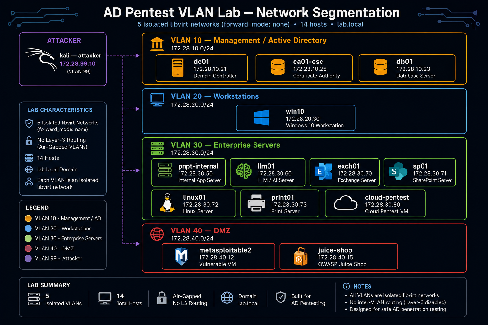

# Advanced Active Directory Penetration Testing Lab (VLAN-Segmented)

## Version 2.1.3 – Enterprise VLAN Edition, Fully Fixed

[](https://opensource.org/licenses/MIT)
[](https://www.linux-kvm.org/)
[](https://www.vagrantup.com/)
[](https://github.com/solo2121/sysadmin-security-lab)

---

## Overview

This repository contains an advanced Active Directory penetration testing lab built with Vagrant and libvirt/KVM, leveraging Linux bridge networking and VLAN segmentation.

The environment simulates a realistic enterprise infrastructure with:

- VLAN-based network segmentation
- Multi-NIC virtual machine architecture
- Windows, Linux, cloud, and web-based services
- Controlled enterprise-style routing and firewalling
- Modern attack surfaces including cloud (LocalStack) and LLM (OWASP Top 10 + advanced techniques)
- CVE-based modern attack vectors: ZeroLogon, PetitPotam, NoPac, RBCD, and PrintNightmare

It is intended for intermediate to advanced security practitioners focused on red team operations, adversary emulation, and enterprise Active Directory security research.

---

## Security Notice

This environment is intentionally vulnerable.

It must only be used in isolated lab conditions for:
- Security research
- Penetration testing practice
- Red team simulation
- Educational purposes

Do not expose this environment to production or public networks.

---

## Key Differences from Standard Lab

| Feature                     | Standard Lab | VLAN Lab |
|----------------------------|--------------|----------|
| Flat network architecture  | Yes          | No       |
| VLAN segmentation          | No           | Yes      |
| Multi-NIC architecture     | Limited      | Yes      |
| Cloud attack simulation    | No           | Yes      |
| LLM attack surface         | No           | Yes      |
| Enterprise routing model   | No           | Yes      |

---

## Requirements

- Ubuntu 22.04+ / Debian 12+
- KVM / QEMU with hardware virtualization
- libvirt >= 8.0
- Vagrant >= 2.2
- Vagrant libvirt plugin
- jq, iproute2, bridge-utils

---

### Installation

```bash
sudo apt update
sudo apt install -y qemu-kvm libvirt-daemon-system libvirt-clients bridge-utils virt-manager vagrant jq

sudo usermod -aG libvirt $USER
newgrp libvirt

vagrant plugin install vagrant-libvirt vagrant-reload vagrant-winrm
```

---

## Repository Structure

```
.
├── Vagrantfile
├── scripts/
├── configs/
├── docs/
├── diagrams/
└── README.md
```

---

## Network Architecture



The lab consists of two primary network layers:

### Management Network

* NAT-based access for updates and tooling
* Not part of attack surface

### VLAN Segmented Networks

| VLAN | Purpose      | Subnet         |
| ---- | ------------ | -------------- |
| 10   | Management   | 172.28.10.0/24 |
| 20   | Workstations | 172.28.20.0/24 |
| 30   | Servers      | 172.28.30.0/24 |
| 40   | DMZ          | 172.28.40.0/24 |
| 99   | Attacker     | 172.28.99.0/24 |

---

## Target Systems

### Active Directory Environment

* DC01 – Domain Controller (172.28.10.21)
* CA01 – Certificate Authority
* DB01 – SQL Server
* WIN10 – Domain workstation
* EXCH01 – Exchange Server
* SP01 – SharePoint Server
* PRINT01 – Print server

### Linux and Cloud Systems

* linux01 – Internal Linux host
* pnpt-internal – internal application server
* llm01 – LLM attack simulation platform
* cloud-pentest – LocalStack AWS simulation

### DMZ Systems

* metasploitable2 – legacy exploitation target
* juice-shop – OWASP web application

### Attacker System

* kali – Red team system (dual NIC: NAT + VLAN 99)

---

## Attack Surfaces

### Active Directory

* AS-REP roasting
* Kerberoasting
* DCSync attacks
* ACL abuse
* AD CS ESC1, ESC3, ESC4, ESC7, ESC9 exploitation
* ZeroLogon (CVE-2020-1472) — Netlogon vulnerability
* PetitPotam (CVE-2021-36942) — NTLM relay coercion
* NoPac (CVE-2021-42287) — SAM account name spoofing
* Resource-Based Constrained Delegation (RBCD) abuse
* PrintNightmare (CVE-2021-1675 / CVE-2021-34527)
* Shadow Credentials attacks

### Cloud (LocalStack)

* S3 bucket enumeration
* IAM privilege escalation
* Metadata service exploitation
* Credential leakage scenarios

### LLM (15 endpoints)

* Prompt injection
* Token bombing
* Embedding inversion
* RAG poisoning
* Function calling injection
* Chain-of-thought leakage

---

## Setup Instructions

### Install Dependencies

```bash
sudo apt update
sudo apt install -y qemu-kvm libvirt-daemon-system libvirt-clients bridge-utils virt-manager vagrant jq
```

### Configure Permissions

```bash
sudo usermod -aG libvirt $USER
newgrp libvirt
```

### Install Plugins

```bash
vagrant plugin install vagrant-libvirt vagrant-reload vagrant-winrm
```

---

## Lab Manager

Use the included interactive manager instead of typing raw Vagrant commands:

```bash
./scripts/vagrant-manager.sh
```

The manager shows all VMs grouped by VLAN with live state and IP address for each. From the menu you can SSH into any running VM, start or halt individual VMs, and start or halt the entire lab with a single key.

VMs are displayed in VLAN order: VLAN 99 (Attacker), VLAN 10 (AD Core), VLAN 20 (Workstations), VLAN 30 (Servers), VLAN 40 (DMZ).

---

## Deployment

```bash
git clone https://github.com/solo2121/sysadmin-security-lab.git
cd sysadmin-security-lab/labs/security/ad-pentest-vlan

vagrant up dc01
vagrant up
```

---

## Validation

```bash
vagrant status
vagrant ssh dc01 -c "whoami"
```

---

## Active Directory Example

```bash
# NoPac (CVE-2021-42287) domain takeover
python3 /opt/impacket/examples/nopac.py lab.local/labadmin:LabAdmin123! -dc-ip 172.28.10.21 -impersonate Administrator

# ZeroLogon (CVE-2020-1472)
python3 /opt/impacket/examples/zerologon.py lab.local DC01 172.28.10.21

# PetitPotam NTLM relay coercion
python3 /opt/impacket/examples/petitpotam.py attacker 172.28.10.21
```

---

## Cloud Example

```bash
aws --endpoint-url=http://172.28.30.80:4566 s3 ls
```

---

## LLM Example

```bash
curl -X POST http://172.28.30.60/v1/chat \
  -H "Content-Type: application/json" \
  -d '{"prompt":"whoami"}'
```

---

## Migration Mode

```bash
export VLAN_PHASE=1
vagrant up
```

---

## Troubleshooting

| Issue            | Solution           |
| ---------------- | ------------------ |
| VLAN not created | Run setup-vlans.sh |
| VM boot failure  | Increase RAM       |
| DNS issues       | Verify DC01 DNS    |
| LLM failure      | Restart service    |

---

## Lab Statistics

* 14 VMs
* 45+ AD users
* 55+ attack paths
* 75+ vulnerabilities
* 15 LLM endpoints

---

## Disclaimer

This environment is intentionally vulnerable and is strictly for authorized security research and educational purposes. Do not expose this lab to production networks, public IPs, or systems you are not authorized to test. Users are solely responsible for compliance with applicable laws and regulations.

---

## Changelog

### v2.1.3 (2026-07-08)

**Fixed:**
- Static IP configuration now uses 5-method adapter detection (target IP,
  lab subnet match, adapter name, non-NAT exclusion, and a debug fallback
  that lists all adapters), plus disabled Duplicate Address Detection and
  set `SkipAsSource=false` so the assigned IP is actually preferred.
- Windows Defender is now disabled via a registry-only approach (silent
  and reliable, no longer relies on `Set-MpPreference` cmdlets that can
  fail before the module loads).
- AD promotion (`Install-ADDSForest`) now passes explicit named
  parameters instead of a splatted hashtable, for clearer failures.
- Domain DN and DNS A records are now hardcoded literals inside the
  PowerShell heredoc instead of Ruby-interpolated, avoiding
  interpolation edge cases.
- Silenced a harmless `Set-NetConnectionProfile` error that fired on
  already-domain-joined VMs.
- Pinned exact box versions for `metasploitable2`
  (`deargle/metasploitable2` @ 0.1.0) and `juice-shop`
  (`ubuntu/jammy64` @ 20241007.0.0).

### v2.1.2 (2026-06-20)

**Fixed:**
- Dynamic Linux interface detection, removing hardcoded `eth1`.
- Production-grade Windows static IP configuration, preventing provisioning hangs.
- Domain join hostname rename checks to prevent duplicate joins.
- Improved DC readiness detection with a ping check before domain join.
- Windows Defender disabled via a dedicated function.
- Domain name defined as a literal in PowerShell blocks to prevent Ruby interpolation issues.
- Correct RAM calculation banner now accounts for all VMs.
- Vagrant plugin check for `vagrant-reload` now shows a clear error message.
- Libvirt default prefix cleared to prevent VM name collisions.

### v2.1.1 (2026-06-18)

**Added:**
- ZeroLogon (CVE-2020-1472) attack path
- PetitPotam (CVE-2021-36942) NTLM relay coercion
- NoPac (CVE-2021-42287) SAM account name spoofing
- Resource-Based Constrained Delegation (RBCD) misconfiguration
- Enhanced PrintNightmare (CVE-2021-1675 / CVE-2021-34527)
- AD CS ESC9 — No Security Extension
- Shadow Credentials attack path
- Built-in attack cheatsheet generated on the Kali VM at `/root/attacks/README.txt`

### v2.1.0 (2026-06-15)

**Added:**
- VLAN segmentation across 5 subnets (Management, Workstations, Servers, DMZ, Attacker)
- LocalStack AWS attack simulation (S3, IAM, EC2)
- 15 LLM security research endpoints
- OWASP Juice Shop and Metasploitable2 legacy targets

---

## Related Labs

- [`../ad-pentest/`](../ad-pentest/) — Flat network version, faster to deploy
- [`../../infrastructure/devops-linux-lab/`](../../infrastructure/devops-linux-lab/) — DevOps and Kubernetes lab

---

## License

[MIT License](../../../LICENSE) — Educational use only.
